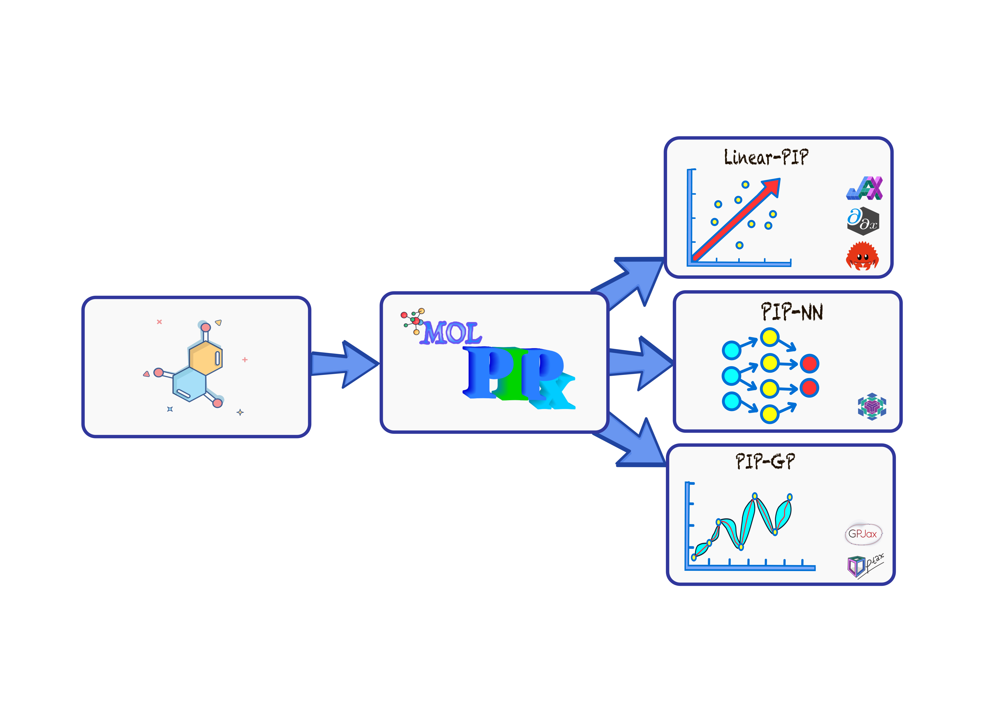

<h1 align='center'></h1>
<h2 align='center'>Differentiable version of Permutationally Invariant Polynomial (PIP) models in JAX, compatible with Flax and the JAX-ecosystem. </h2>

**MOLPIPx** is a [JAX](https://jax.readthedocs.io/en/latest/)-based library that provides an implementation of PIP models compatible with,
1. [FLAX](flax.readthedocs.io/): Nueral network library.
2. GPU friendly.
3. Fully differentiable.

## MSA files to JAX ##
This library translates the [MSA](https://scholarblogs.emory.edu/bowman/msa/) files, specifically the ``_file_.MONO`` and ``_file_.POLY`` files to the corresponding JAX version, ``_file_mono.py`` and ``_file_poly.py``. 
The MSA files must be generated before, for more information please see https://github.com/szquchen/MSA-2.0


**MSA References:**
* Xie, Z.; Bowman, J.M. Permutationally Invariant Polynomial Basis for Molecular Energy Surface Fitting via Monomial Symmetrization. J. Chem. Theory Comput. 2010, 6, 26-34.


### MSA-JAX files generation ###
```python
from molpipx import msa_file_generator

head_files = 'MOL_<info>_<deg>'
path = '<path_to_the_files>'
label = '<file_label>'
msa_file_generator(head_files, path, label)
```


The structure of the library is kept simple, as each molecular system could need individual elements. 


## Models ##
MOLPIPx incorporated PIPs with three main regression models, i.e., linear regression, neural networks and Gaussian processes. This library leverages two main automatic differentiation engines, JAX for
The Python version and Enzyme-AD for the Rust version improve the simulation of a wide range of chemical systems.

<h1 align='center'></h1>

## Installation ##
Install MOLPIPx via PyPi:

`pip install molpipx`

## Tutorials ##
Check out our tutorials to get started with MOLPIPx. These tutorials define inputs for different regression approaches, train machine learning models with or without forces, and make predictions.

1. [Linear regression with permutationally invariant polynomials (Linear PIP)](linear_pip/README.md)
2. [Anisotropic linear regression with permutationally invariant polynomials (Anisotropic Linear PIP)](aniso_pip/README.md)
3. [Permutationally Invariant Polynomial Neural Networks (PIP-NN)](pipnn/README.md)
4. [Permutationally Invariant Polynomial Gaussian Process (PIP-GP)](pipgp/README.md)